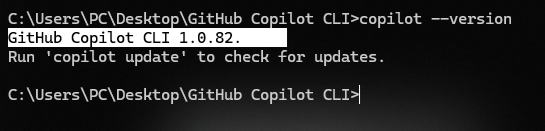

# 🤖 GitHub Copilot CLI 101. 

Welcome to the **GitHub Copilot CLI for Beginners** practice repository! This repository is designed to help beginners learn and practice GitHub Copilot CLI, custom agents, and AI-powered development workflows through practical, hands-on activities.


## 🚀 Introduction and Overview

GitHub Copilot CLI brings the power of **GitHub Copilot directly to your terminal**. It allows you to work with an AI coding agent without leaving your command line.

With GitHub Copilot CLI, you can:

- ✅ **Work from the terminal** - Use Copilot directly from your command line.
- ✅ **Connect with GitHub** - Work with repositories, issues, and pull requests using natural language.
- ✅ **Get AI assistance** - Ask Copilot to create, edit, debug, explain, and improve your code.
- ✅ **Extend its capabilities** - Use MCP servers to connect Copilot with additional tools and services.
- ✅ **Stay in control** - Review and approve actions before Copilot executes them.

### 🎯 What We'll Learn

In this assessment, we'll start from the basics and gradually learn how to use **GitHub Copilot CLI** effectively in the terminal.

> **💡 Beginner Tip:** You don't need to be an expert to get started. Follow each step carefully and try the commands yourself.

## ❇️ You will explore here.

- Use GitHub Copilot CLI
- Create custom agents
- Automate tasks
- Apply AI-assisted development

## 📍 Prerequisites.

Before starting, make sure you have the following:

| **Requirement** | **Details** |
|---|---|
| **GitHub account** | Free or paid GitHub account - sign up at [GitHub.com](https://github.com) |
| **GitHub CLI (`gh`)** | Version 2.x or later - install from the official [GitHub CLI website](https://cli.github.com) |
| **Git** | [Git](https://git-scm.com/install/) installed and configured on your computer |
| **GitHub Copilot subscription** | Individual, Business, or Enterprise plan. [See Copilot plans](https://github.com/features/copilot/plans?ref_cta=Copilot+plans+signup&ref_loc=install-copilot-cli&ref_page=docs) |
| **A code editor** | Any code editor works; [VS Code](https://code.visualstudio.com/download?_exp_download=d53503e735) is recommended |
| **Terminal access** | Windows PowerShell/Command Prompt, macOS Terminal, or Linux shell |
| **Basic Git knowledge** | Familiarity with repositories, branches, commits, push, and pull |
| **Internet connection** | Required to communicate with GitHub services |

> **Note:** A **GitHub Copilot subscription is not required for basic GitHub CLI usage**. It is only needed if you specifically uses **GitHub Copilot CLI features**.

## 🎯 Getting Started.

### Step 01 - Create a Project Folder

Before installing and using GitHub Copilot CLI, it is recommended to create a **dedicated folder** for this assessment.

#### Example For Windows
 ```
1. Create a new folder on your Desktop.
2. Give it a meaningful name, for example:
GitHub Copilot CLI
```

Then, Navigate to the folder. Open PowerShell or Command Prompt and run the following command:

```powershell
cd Desktop\GitHub Copilot CLI
```

### Step 02 - Install GitHub Copilot CLI

After creating your assessment folder, the next step is to install GitHub Copilot CLI.

#### Homebrew (macOS and Linux):

```powershell
brew install copilot-cli
```
```powershell
brew install copilot-cli@prerelease
```

#### WinGet (Windows):

```powershell
winget install GitHub.Copilot
```
```powershell
winget install GitHub.Copilot.Prerelease
```

#### npm (macOS, Linux, and Windows):

```powershell
npm install -g @github/copilot
```
```powershell
npm install -g @github/copilot@prerelease
```

#### Verify the installation:

```powershell
copilot --version
```
#### Output:



# 🤝Hands-On Activity & Submission Guide


